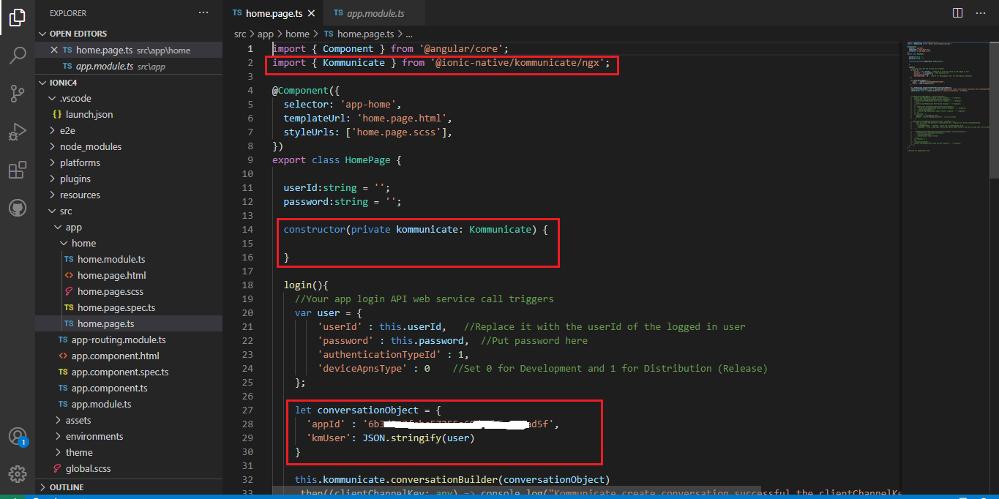
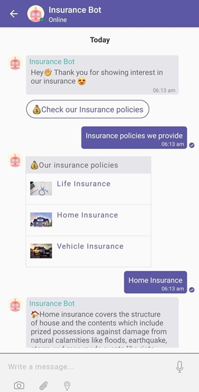

# Kommunicate-Ionic-Cordova-Sample-App
Sample App for Ionic/Cordova/Phonegap using the Kommunicate cordova plugin

## Overview

Kommunicate provides open source live chat SDK in Ionic. The Kommunicate SDK is flexible, lightweight and easily integrable. It lets you easily add real time live chat and in-app messaging in your mobile applications and websites for customer support. The SDK is equipped with advance messaging options such as sending attachments, sharing location and rich messaging.

To get started with Kommunicate Ionic, head over to [Kommunicate](http://www.kommunicate.io/) website and [Signup](https://dashboard.kommunicate.io/signup) to get your Application ID.


## Example

To run the example project using Angular.

 1. Make sure Node.js is installed.
 
 2. Install the Ionic CLI with npm:
```
npm install -g @ionic/cli cordova
```
 3. Download the project as ZIP & open in code editor
 
 4. Change the appId with your APP_ID - You'll get it from [Install](https://dashboard.kommunicate.io/settings/install) section
 
 
 
 5. Build & then Run the ionic app.



## Docs

Please checkout [Documentation](https://docs.kommunicate.io/docs/cordova-installation) for more details.
